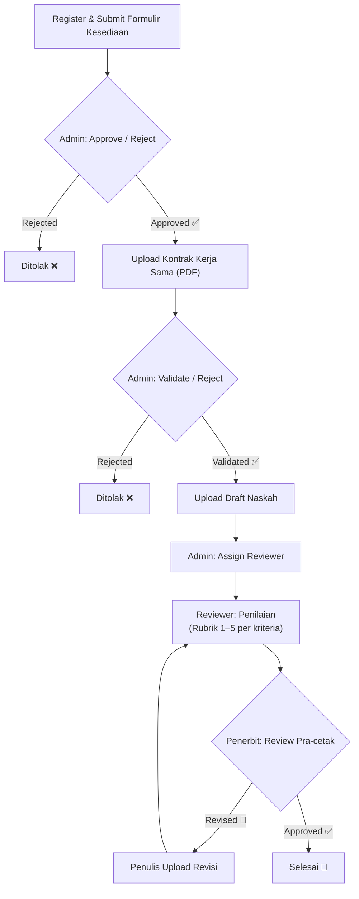

# Hibah Buku Frontend

Frontend web aplikasi **Sistem Manajemen Hibah Buku (AEP)** — platform untuk mengelola alur hibah buku dari tahap pendaftaran penulis, review naskah, hingga penerbitan.

Dibangun dengan **SvelteKit 2**, **Svelte 5** (runes mode), dan **TailwindCSS 4**. Terhubung ke backend Laravel API (`hibah-buku-backend`).

---

## Daftar Isi

- [Gambaran Umum](#gambaran-umum)
- [Alur Bisnis](#alur-bisnis)
- [Role Pengguna](#role-pengguna)
- [Fitur per Modul](#fitur-per-modul)
- [Arsitektur & Struktur Proyek](#arsitektur--struktur-proyek)
- [Tech Stack](#tech-stack)
- [Persiapan & Instalasi](#persiapan--instalasi)
- [Konfigurasi](#konfigurasi)
- [Jalankan Development Server](#jalankan-development-server)
- [Build untuk Produksi](#build-untuk-produksi)
- [Panduan Struktur Route](#panduan-struktur-route)
- [Panduan API Client](#panduan-api-client)
- [Script yang Tersedia](#script-yang-tersedia)
- [Catatan Pengembangan](#catatan-pengembangan)

---

## Gambaran Umum

Sistem Hibah Buku AEP adalah aplikasi web yang mengelola seluruh siklus program hibah buku:

1. **Pendaftaran** — Penulis mendaftar dan mengirimkan formulir kesediaan menulis buku beserta informasi co-author dan data buku.
2. **Validasi** — Admin meninjau, menyetujui, atau menolak formulir kesediaan.
3. **Kontrak** — Penulis yang disetujui mengunggah kontrak kerja sama dalam format PDF untuk divalidasi admin.
4. **Upload Naskah** — Penulis mengunggah draft awal naskah buku.
5. **Plotting Reviewer** — Admin menugaskan reviewer untuk melakukan penilaian naskah secara blind review.
6. **Penilaian** — Reviewer menilai naskah berdasarkan rubrik penilaian (skor 1–5 per kriteria).
7. **Hasil Review** — Penulis melihat hasil review secara double-blind.
8. **Review Penerbit** — Penerbit melakukan review pra-cetak dengan checklist verifikasi.
9. **Revisi** — Jika diperlukan perbaikan, penulis mengunggah naskah revisi dan siklus berulang.

---

## Alur Bisnis



---

## Role Pengguna

| Role | Deskripsi | Route |
|------|-----------|-------|
| **Admin** | Mengelola seluruh sistem: user, formulir, kontrak, plotting reviewer, rubrik | `/admin/*` |
| **Penulis** | Mendaftar, upload kontrak, upload draft/revisi, upload dokumen, lihat hasil review | `/author/*` |
| **Penerbit** | Review naskah pra-cetak, verifikasi kelengkapan, keputusan akhir | `/publisher/*` |
| **Reviewer** | Menilai naskah berdasarkan rubrik penilaian yang ditugaskan | `/reviewer` |
| **Publik** | Belum login — halaman login dan pendaftaran kesediaan | `/login`, `/register-willingness` |

---

## Fitur per Modul

### Modul Admin (`/admin/*`)

| Halaman | Deskripsi |
|---------|-----------|
| **Dashboard** | Statistik (total penulis, formulir menunggu, kontrak menunggu, total user), aktivitas terbaru, aksi cepat |
| **Manajemen User** | Daftar, cari, filter berdasarkan role, detail, edit, tambah, nonaktifkan |
| **Formulir Kesediaan** | Filter status (pending/approved/rejected), detail, approve/reject dengan alasan |
| **Kontrak** | Filter status, detail, PDF viewer (zoom, navigasi, download, cetak), validate/reject |
| **Plotting Naskah** | Assign naskah ke reviewer, pilih deadline |
| **Rubrik Penilaian** | CRUD rubrik kriteria penilaian secara inline |
| **Notifikasi** | Bell notifikasi di topbar, daftar notifikasi terbaru |

### Modul Penulis (`/author/*`)

| Halaman | Deskripsi |
|---------|-----------|
| **Dashboard** | Status manuskrip, ringkasan draft, timeline alur prosedur hibah |
| **Upload Kontrak** | Unggah kontrak (PDF, maks 5MB). 4 state: belum ada, pending, approved, rejected |
| **Upload Draft** | Form upload draft naskah (judul, kategori, halaman, abstrak, file). Hanya aktif jika kontrak approved |
| **Upload Revisi** | Unggah file revisi (PDF/DOC/DOCX, maks 20MB) |
| **Upload Dokumen** | 3 jenis: surat pernyataan, scan bermeterai, dokumen pendukung |
| **Hasil Review** | Ringkasan skor reviewer (double-blind), review penerbit (pra-cetak) |
| **Riwayat File** | Aggregasi seluruh berkas dengan tab filter |

### Modul Penerbit (`/publisher/*`)

| Halaman | Deskripsi |
|---------|-----------|
| **Dashboard** | Statistik: pra-cetak, menunggu revisi, siap cetak. Daftar naskah cepat |
| **Daftar Naskah** | Filter & cari berdasarkan judul, penulis, status |
| **Detail Naskah** | PDF viewer (server-side download), checklist verifikasi, keputusan approved/revised |

### Modul Reviewer (`/reviewer`)

| Komponen | Deskripsi |
|----------|-----------|
| **Daftar Tugas** | Card tugas: status (assigned/under_review/completed), deadline, skor akhir |
| **Preview Buka** | Buka file naskah di tab baru |
| **Form Penilaian** | Rubrik per kriteria (skor 1–5), komentar, rekomendasi akhir |
| **Detail Hasil** | Lihat skor dan komentar yang sudah disubmit |

---

## Arsitektur & Struktur Proyek

```
hibah-buku-frontend/
├── src/
│   ├── app.html
│   ├── lib/
│   │   ├── api/
│   │   │   ├── client.js              # API fetch wrapper
│   │   │   ├── endpoint.js            # Centralisasi API endpoint
│   │   │   ├── notifications.js       # Helper notification logs
│   │   │   └── config/
│   │   │       └── adminRoutes.js     # Route map quick action
│   │   ├── assets/
│   │   │   └── favicon.svg
│   │   ├── components/
│   │   │   ├── admin/                 # Komponen admin
│   │   │   │   ├── contracts/         # ContractsTable, Modals
│   │   │   │   ├── dashboard/         # StatCard, QuickAction, Activity
│   │   │   │   ├── users/             # UsersTable, DeleteModal
│   │   │   │   └── willingness-forms/ # WillingnessFormsTable
│   │   │   ├── author/                # Komponen penulis
│   │   │   │   ├── dashboard/         # AuthorDashboard, StatCard
│   │   │   │   ├── upload-draft/      # DraftUploadForm
│   │   │   │   └── upload-revision/   # RevisionUploadForm
│   │   │   ├── layouts/               # Layout bersama
│   │   │   │   ├── AppSidebar         # Sidebar admin
│   │   │   │   ├── AppTopbar          # Topbar admin
│   │   │   │   ├── AuthorSidebar      # Sidebar penulis
│   │   │   │   ├── AuthorTopbar       # Topbar penulis
│   │   │   │   ├── PublisherSidebar   # Sidebar penerbit
│   │   │   │   ├── PublisherTopbar    # Topbar penerbit
│   │   │   │   └── NotificationBell   # Bell notifikasi (shared)
│   │   │   └── publisher/             # Komponen penerbit
│   │   │       ├── dashboard/         # QuickManuscriptList
│   │   │       └── manuscripts/       # ManuscriptsTable, DecisionForm
│   │   └── utils/
│   │       └── errorMapper.js         # Error validasi EN → ID
│   └── routes/
│       ├── (public)/                  # Rute publik
│       │   ├── login/
│       │   └── register-willingness/
│       ├── admin/                     # Panel admin
│       │   ├── dashboard/
│       │   ├── contracts/  [id]/
│       │   ├── users/      [id]/ edit/ create/
│       │   ├── willingness-form/ [id]/
│       │   ├── tasks/
│       │   ├── rubrics/
│       │   └── logout/
│       ├── author/                    # Panel penulis
│       │   ├── dashboard/
│       │   ├── upload-kontrak/
│       │   ├── upload-draft/
│       │   ├── upload-revision/
│       │   ├── upload-document/
│       │   ├── documents/ download/
│       │   ├── review-results/
│       │   └── logout/
│       ├── publisher/                 # Panel penerbit
│       │   ├── dashboard/
│       │   └── manuscripts/ [id]/
│       └── reviewer/                  # Panel reviewer
├── static/
├── package.json
├── svelte.config.js
├── vite.config.js
├── eslint.config.js
└── jsconfig.json
```

### Pola Arsitektur

| Aspek | Pola |
|-------|------|
| **Auth** | Cookie-based (`auth_token`), Bearer header |
| **Routing** | Role-based: `/admin/*`, `/author/*`, `/publisher/*`, `/reviewer` |
| **Auth Guard** | Server-side di `+layout.server.js` — cek token + role |
| **State Management** | Svelte 5 runes: `$state`, `$derived`, `$effect`, `$props`, `$bindable` |
| **Forms** | SvelteKit progressive enhancement via `use:enhance` + form actions |
| **PDF Viewer** | pdf.js 3.11 via CDN script injection |
| **Notifikasi** | `NotificationBell` shared component di semua layout |
| **Error Handling** | `errorMapper.js` — validasi error EN → ID |

---

## Tech Stack

| Teknologi | Versi | Fungsi |
|-----------|-------|--------|
| [SvelteKit](https://kit.svelte.dev/) | 2.57 | Framework full-stack (routing, SSR, form actions) |
| [Svelte](https://svelte.dev/) | 5.55 | UI library (runes mode) |
| [TailwindCSS](https://tailwindcss.com/) | 4.2 | Utility-first CSS framework |
| [Vite](https://vite.dev/) | 8.0 | Build tool & dev server |
| [Iconify](https://iconify.design/) | — | Icon library (`@iconify/svelte`) |
| [PDF.js](https://mozilla.github.io/pdf.js/) | 3.11 | Render PDF di browser (CDN) |
| [ESLint](https://eslint.org/) | 10.2 | Linting kode |
| [Prettier](https://prettier.io/) | 3.8 | Format kode |

> **Backend:** Laravel API (terpisah — dijalankan di `hibah-buku-backend.test`)

---

## Persiapan & Instalasi

### Prasyarat

- **Node.js** ≥ 18
- **npm** (atau pnpm / yarn)
- **Backend Laravel** yang sudah dijalankan

### Instalasi

```bash
git clone <url-repo>
cd hibah-buku-frontend
npm install
```

---

## Konfigurasi

### Variabel Lingkungan

Buat file `.env` di root proyek:

```env
VITE_API_BASE_URL=http://localhost:8000/api
```

> Jika tidak diset, API client menggunakan `http://localhost:8000/api` sebagai default.

### Proxy API (Development)

Vite memproxy semua request `/api` ke backend secara otomatis:

```js
// vite.config.js
server: {
  proxy: {
    '/api': {
      target: 'http://hibah-buku-backend.test',
      changeOrigin: true,
      secure: false,
      credentials: true
    }
  }
}
```

Ubah `target` di atas jika URL backend berbeda.

---

## Jalankan Development Server

```bash
# Jalankan dev server
npm run dev

# Atau buka langsung di browser
npm run dev -- --open
```

Aplikasi tersedia di `http://localhost:5173` (default Vite).

---

## Build untuk Produksi

```bash
npm run build      # Build
npm run preview    # Preview hasil build
```

> Untuk deployment, sesuaikan adapter di `svelte.config.js` (saat ini: `@sveltejs/adapter-auto`).

---

## Panduan Struktur Route

Setiap modul role mengikuti pola yang konsisten:

```
routes/<role>/
├── +layout.server.js    # Auth guard: cek token + role
├── +layout.svelte       # Layout: sidebar + topbar + main
├── <page>/
│   ├── +page.server.js  # Load data + form actions
│   └── +page.svelte     # UI
└── logout/
    ├── +page.server.js  # Hapus cookie → redirect /login
    └── +page.svelte
```

### Pola Auth Guard

```js
// +layout.server.js (contoh admin)
export const load = async ({ cookies }) => {
  const token = cookies.get('auth_token');
  if (!token) throw redirect(303, '/login');

  const profile = await apiGet(ENDPOINTS.AUTH.ME, {}, { cookies });
  const user = profile?.data;

  if (String(user?.role) !== 'admin') throw redirect(303, '/login');

  return { user, notificationLogs };
};
```

### Pola Form Action

```js
// +page.server.js (contoh)
export const actions = {
  default: async ({ request, cookies }) => {
    const data = await request.formData();
    const payload = Object.fromEntries(data);

    try {
      await apiPost(ENDPOINTS.SOME_ENDPOINT, payload, {}, { cookies });
      return { success: true };
    } catch (err) {
      if (err.status === 422) {
        return fail(422, { errors: err.data?.errors });
      }
      return fail(err.status || 500, { message: err.message });
    }
  }
};
```

---

## Panduan API Client

Seluruh komunikasi dengan backend Laravel dilakukan melalui `$lib/api/client.js`:

```js
import { apiGet, apiPost, apiPatch, apiDelete, apiDownload } from '$lib/api/client.js';
import { ENDPOINTS } from '$lib/api/endpoint.js';

// GET dengan query params
const users = await apiGet(ENDPOINTS.USERS.INDEX, { search: 'john' }, { cookies });

// POST (create)
const result = await apiPost(ENDPOINTS.USERS.STORE, { name, email }, {}, { cookies });

// PATCH (update)
await apiPatch(ENDPOINTS.USERS.UPDATE(id), { name, email }, {}, { cookies });

// DELETE
await apiDelete(ENDPOINTS.USERS.DESTROY(id), {}, { cookies });

// Download file
const fileData = await apiDownload(ENDPOINTS.CONTRACTS.DOWNLOAD(id), {}, { cookies });
```

### Endpoint Registry

Semua endpoint terpusat di `$lib/api/endpoint.js`:

| Module | Konstanta | Endpoint |
|--------|-----------|----------|
| Auth | `AUTH.LOGIN` | `POST /auth/login` |
| Auth | `AUTH.ME` | `GET /auth/me` |
| Users | `USERS.INDEX` | `GET /users` |
| Users | `USERS.STORE` | `POST /users` |
| Willingness | `WILLINGNESS.SUBMIT` | `POST /auth/register-willingness` |
| Contracts | `CONTRACTS.MY_CONTRACT` | `GET /contracts/me` |
| Dashboard | `DASHBOARD.SUMMARY` | `GET /dashboard` |
| Manuscripts | `MANUSCRIPTS.UPLOAD_DRAFT` | `POST /manuscripts/upload-draft` |
| Publisher | `PUBLISHER.MANUSCRIPTS` | `GET /publisher/manuscripts` |
| Reviewers | `REVIEWERS.ASSIGNMENTS(id)` | `GET /reviewers/:id/assignments` |
| Assignments | `ASSIGNMENTS.REVIEWS(id)` | `POST /assignments/:id/reviews` |
| Rubrics | `RUBRICS.INDEX` | `GET /rubrics` |
| Notifications | `NOTIFICATIONS.LOGS` | `GET /notification-logs` |

> Lihat `src/lib/api/endpoint.js` untuk daftar lengkap.

---

## Script yang Tersedia

| Command | Deskripsi |
|---------|-----------|
| `npm run dev` | Development server (Vite) |
| `npm run build` | Build untuk produksi |
| `npm run preview` | Preview hasil build |
| `npm run lint` | Prettier check + ESLint |
| `npm run format` | Format kode dengan Prettier |

---

## Catatan Pengembangan

- **Svelte 5 Runes Mode** — Semua komponen pakai `$state`, `$derived`, `$effect`, `$props`, `$bindable`. Tidak ada lagi `let` / `$:` reactive lama.
- **PDF Viewer** — Dimuat dari CDN Mozilla (`pdfjs-dist@3.11.174`). Digunakan di admin contracts dan publisher decision.
- **Blind Review** — Identitas reviewer tidak ditampilkan ke penulis.
- **Server-side Proxy Download** — File naskah diunduh via proxy (`/author/documents/download/+server.js`) agar token tetap aman.
- **NotificationBell** — Komponen shared di semua layout admin/author/publisher.
